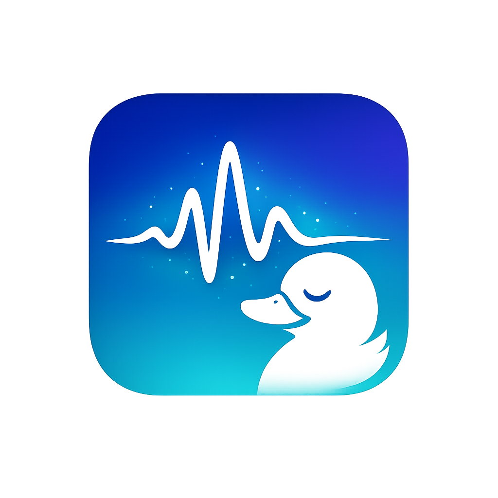

# HushDuck

<p align="center">
  
</p>

A tiny macOS menu bar utility that **mutes your system audio while you hold the Fn key**. Built for voice dictation workflows where you don't want music, notifications, or other audio bleeding into your microphone.

Some media players (Apple Music, Spotify, etc.) will even **pause playback** while ducked, so you pick up right where you left off.

## Download

**[Download HushDuck v1.0](https://github.com/padresb/HushDuck/releases/download/v1.0/HushDuck-v1.0.zip)** — Signed and notarized by Apple. Unzip and drag to Applications.

## How It Works

1. HushDuck sits quietly in your menu bar
2. Hold **Fn** &rarr; system audio mutes instantly
3. Release **Fn** &rarr; audio restores to its previous state

That's it. If your audio was already muted before pressing Fn, HushDuck won't unmute it on release.

## Menu Bar States

| Icon | Status | Meaning |
|------|--------|---------|
| `waveform` | **Normal** | Ready and waiting for Fn key |
| `waveform.path.ecg` | **Ducking** | Fn held, audio is muted |
| `waveform.slash` | **Paused** | Monitoring disabled by user |
| `waveform.badge.exclamationmark` | **Needs Permission** | Accessibility access required |

## Requirements

- macOS 13 (Ventura) or later
- **Accessibility permission** — required for global key monitoring. HushDuck will prompt you on first launch.

## Build & Install

```bash
# Clone the repo
git clone https://github.com/padresb/HushDuck.git
cd HushDuck

# Build and package as .app
./build-app.sh

# Install to Applications
cp -r .build/release/HushDuck.app /Applications/
```

Or build manually:

```bash
swift build -c release
```

## Safety Features

- **Preserves mute state** — If you manually muted your audio, HushDuck won't interfere with it
- **Crash recovery** — If the app crashes while audio is ducked, it automatically unmutes on next launch
- **Sleep aware** — Automatically unducks before your Mac sleeps
- **Device switching** — Handles audio output device changes while ducked
- **Clean quit** — Always restores audio state when quitting

## Architecture

```
Sources/HushDuck/
├── HushDuckApp.swift        # App entry point
├── AppDelegate.swift        # Central coordinator and lifecycle management
├── AppState.swift           # Observable shared state
├── FnKeyMonitor.swift       # CGEventTap-based Fn key detection
├── AudioController.swift    # CoreAudio mute/unmute control
├── PermissionManager.swift  # Accessibility permission handling
├── StatusItemManager.swift  # Menu bar icon and native NSMenu
├── CrashRecovery.swift      # UserDefaults-based crash safety
```

**Key technologies:**
- **CGEventTap** (`.listenOnly`) for global Fn key monitoring via `flagsChanged` events
- **CoreAudio** (`AudioObjectSetPropertyData`) for instant system mute control
- **NSStatusItem** with native **NSMenu** for standard macOS menu bar appearance
- **Swift Package Manager** for builds, no external dependencies

## Permissions

HushDuck requires **Accessibility** access to monitor the Fn key globally. It does **not** need to be sandboxed. On first launch, you'll be directed to:

**System Settings > Privacy & Security > Accessibility**

If you rebuild the app and permissions stop working, reset them with:

```bash
tccutil reset Accessibility com.hushduck.app
```

## License

MIT
